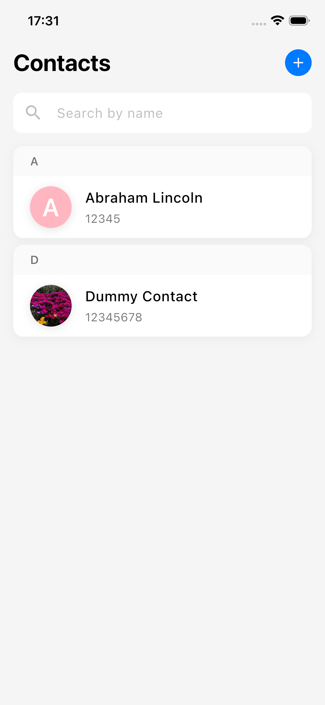
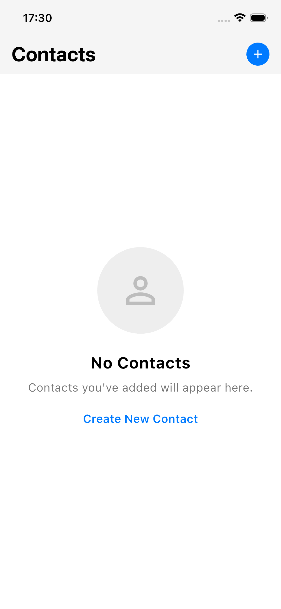
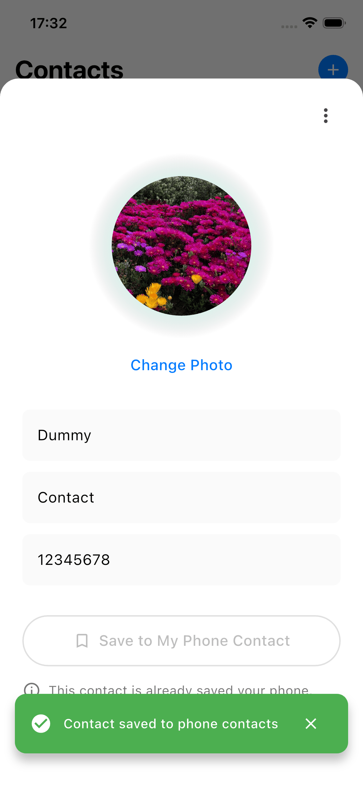
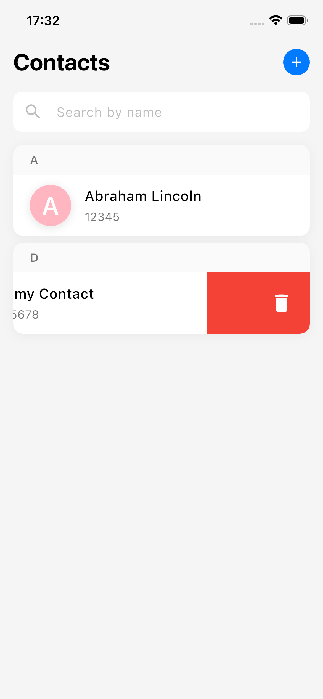
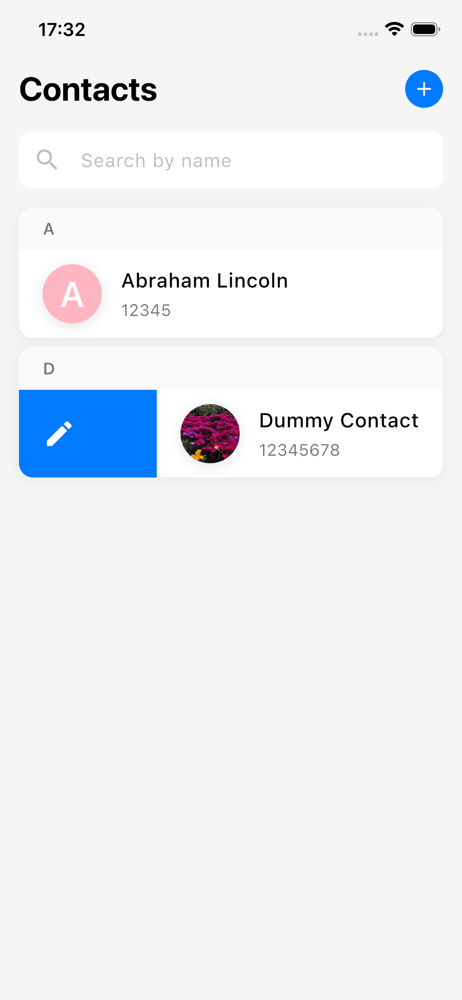
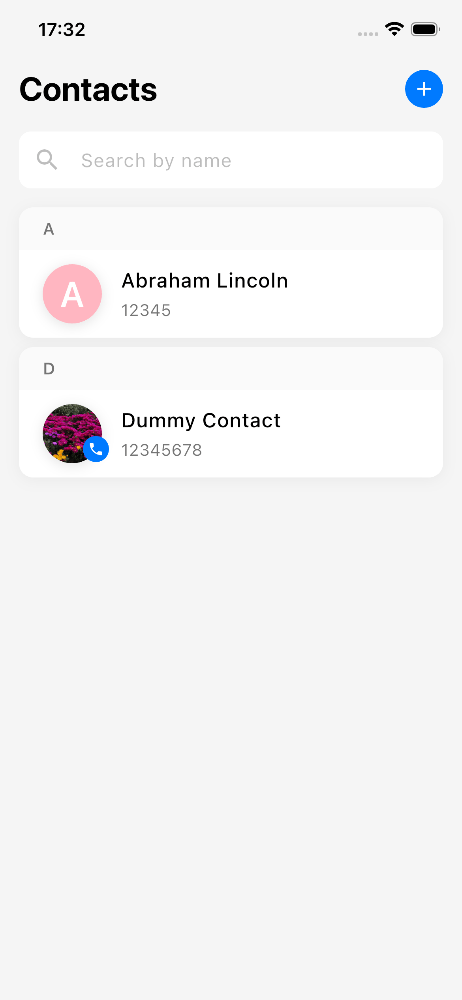

# Welcome

Welcome to the Flutter Contacts Case Study. This is a case study that shows how to build a contacts app using Flutter.

## Getting Started

To use this application, you must configure your API key configured in ./lib/app_common/config/config.dart file.

## Important Considerations about the App
* All the errors realated to the server and device permissions are handled gracefully.
* All contact adding, updating, and deleting operations are fully functional and performed optimistically. Which means,if server updates are not successful, the state is reversed (rollback).
* For state management, I used Riverpod. This might be a good choice for larger apps. However, I wanted to demonstrate proper state management using Riverpod. One of the cases which I found to be useful is that app wide snackbar. You can check it under /app_common/snackbar folder. It allows us to show snackbars globally without passing the context.

Note:
* Removal of user profile image is not implemented since it is not required in the requirements document and related server functionality is not implemented.

## Bonuses
* App is fully functional regardless of the device screen size. -> mobile phone only (as requested for only phones). on tablets, the buttons might be expanded.
* App images are cached on the device for 30 days. -> you can test this by turning off the wifi and open the app again.
* Image sizes are downscaled to 600x600 for all images, which I found to be a good compromise between quality and size.
* All the contacts are also cached on device (forever, until the app is removed from the device).

  
  
  
  
  
  

